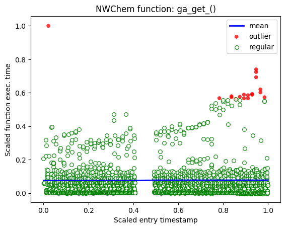

# Performance Data Analysis

This library is part of the [CHIMBUKO](https://github.com/CODARcode/Chimbuko) software framework and provides the Python API to process [TAU](http://tau.uoregon.edu) performance traces which can be produced by multiple workflow components, processes, and threads. Its purpose is to detect events in the trace data that reveal useful information to developers of High Performance Computing applications. The library is composed of the following modules:
  - Parser: parses a given TAU trace (both streaming and batch through [ADIOS](https://www.olcf.ornl.gov/software_package/adios/)).
  - Event: keeps track of event information such as function call stacks and function execution times for various programs, processes and threads.
  - Outlier: detects outliers in the trace data.
  - Visualizer: provides an interface to Chimbuko's visualization [software](https://github.com/CODARcode/ChimbukoVisualization) (both online and offline through Python's `requests` API).

# Requirements

Our codebase requires Python 3.5 or higher, and `python` and `pip` need to be linked to Python 3.5 or higher.
All required Python packages can be found in the `requirements.txt` file. The `adios` and `adios_mpi` Python packages require [ADIOS 1.13.1](https://users.nccs.gov/~pnorbert/adios-1.13.1.tar.gz) to be installed.  

# Installation

## Docker
The easiest way :wink: to get started with the package is by [building a Docker image](https://docs.docker.com/get-started/part2/#build-the-app) with the following command:

    docker build -t imagename .

Once the image is built you can run it as follows:

    docker run imagename

or interactively like this:

    docker run -it imagename /bin/bash

Once inside the image you can run the performance anlaysis code by following the instructions in the Usage section below.

## Native
  - Install ADIOS by running the following commands:
    - `wget https://users.nccs.gov/~pnorbert/adios-1.13.1.tar.gz`
    - `tar xvfz adios-1.13.1.tar.gz`
    - `cd adios-1.13.1`
    - `./configure CFLAGS="-fPIC" --prefix=/path/to/install/location`
    - `make && make install`
    - `export PATH=$PATH:/path/to/install/location`
    - `pip3 install numpy`
    - `pip3 install --trusted-host pypi.python.org -r requirements.txt`

# Testing

To run tests simply type:

    make test

# Usage

## Running a simple test case

To run a simple test case, in the `scripts/` directory, execute the following command: 

    bash run_perfanal.sh perfanal.cfg

The above sets the `PYTHONPATH` and then calls the main driver script `perfanal.py` with `perfanal.cfg` as an argument.
The code performs outlier detection on function execution times, and in addition to the standard output, also produces files for the visualization module and puts them in the `untracked\results` directory.

## The configuration file

```
[Parser]
ParseMode = Adios

[Adios]
Method = BP
# DATASPACES, FLEXPATH
Parameters = verbose=3
InputFile = ../data/nwchem/20180801/tau-metrics.bp

[Outlier]
Algorithm = Sstd

[Lof]
n_neighbors = 500
algorithm = auto
leaf_size = 300
metric = minkowski
p = 2
metric_params = None
contamination = 0.001
fixcontamination = 10
n_jobs = 1

[Sstd]
Sigma = 6
contamination = 0.001
fixcontamination = 10

[Visualizer]
MaxFunDepth = 10
VizMethod = offline
VizUrl = http://0.0.0.0:80/events
#VizUrl = http://10.2.228.192:5000/events
OutputFile = ../untracked/results/

[Debug]
StopLoop = -1 
# If < 0 do not stop loop
LogFile = perfanal.log
LogFileMode = a 
# a, ?
LogLevel = INFO 
# CRITICAL, ERROR, WARNING, INFO, DEBUG
Format = %(asctime)s - %(processName)s - %(threadName)s - %(filename)s - %(lineno)d - %(levelname)s - %(message)s
# %(pathname)s
```

### Parser
Currently parsing happens through ADIOS only therefore `ParserMode` needs to be set to `Adios`.

### Adios
This section allows you to set various ADIOS options. 
  - Method: gets passed to ADIOS' `file()` function, it determines how the trace data is transfered between the application and the analysis code. For online streaming use `DATASPACES` or `FLEXPATH`. If the trace data is already available in `.bp` file format then set `Method` to `BP`.
  - Parameters: accepts multiple values and gets passed to ADIOS' `read_init()` function.
  - InputFile: is a necessary input for ADIOS' `file()` function in both streaming and batch scenarios.

### Outlier
Determines the method used for outlier detection. It currently accepts two options `Sstd` or `Lof`. 
  - `Sstd` computes a rolling mean and standard deviation for function execution times. If a particular execution time is more than `Sigma` standard devations away from the mean it is labeled as an outlier.
  - `Lof` measures the local deviation of density of a given sample with respect to its neighbors. It is local in that the anomaly score depends on how isolated the object is with respect to the surrounding neighborhood. If the local density is for a function execution time is low it is labeled as an outlier. More informatino about the algorithm can be found [here](https://scikit-learn.org/stable/modules/generated/sklearn.neighbors.LocalOutlierFactor.html).

### Lof and Sstd
These sections allow the user to set parameters specific to the outlier detection algorithms. For more information about the `Lof` parameters read the information [here]([here](https://scikit-learn.org/stable/modules/generated/sklearn.neighbors.LocalOutlierFactor.html). The `Sstd` parameters can be interepreted as follows:
  - Sigma: threshold for the how many standard deviation away from the mean data points are labeled as outliers. 
  - contamination: allows the user to only show the top percent of all outliers (this is simalar to the `Lof` parameter).
  - fixcontamination: allows the user to restrict detected anomalies to a fixed number.

### Visualizer
This section governs how the analysis and the visualization codes interact with each other.
  - MaxFunDepth: If functions are deeper than `MaxFunDepth` in the call stack tree exclude them from the list of outlier functions that are passed to the visualization server.
  - VizMethod: send data to the visualization server through the `requests` API if set to `online`, or output `.json` files to be parsed by the visualization software if set to offline.
  - VizUrl: if `VizMethod` is set to `online` send data to this url.
  - OutputFile: if `VizMethod` is set to `offline` write files to this directory.

### Debug
There are mainly two main controls in this section.
  - StopLoop: this allows control over how many ADIOS frames the analysis code will process.
  - Logger settings: the remaining options are all realted to setting parameters used by [logger](https://docs.python.org/3/library/logging.html).


# What happens when running the analysis?

  1. The driver script `perfanal.py` enters a `for` loop that extracts ADIOS frames via the configured method. 
  2. After extracting the data frame it builds a function call stack and starts to compute the function execution times for all function calls that have exited.
  3. The function entry and execution times are passed to the outlier detection algorithm, which performs either `Sstd` or `Lof` on the data.
  4. The computed information (trace data and outlier labels) are passed to the visualization server via the configured method.
  
  The following picture gives a visual representation of the results:



The picture depicts function execution times of an [NWChem](https://github.com/hjjvandam/nwchem-1/tree/pretauadio/contrib/codar_integration) function `ga_get_()`. Each bubble represents how long a particular function call of `ga_get_()` took. The red ones are the outliers, which were computed using `Sstd` with `Sigma = 6`.
