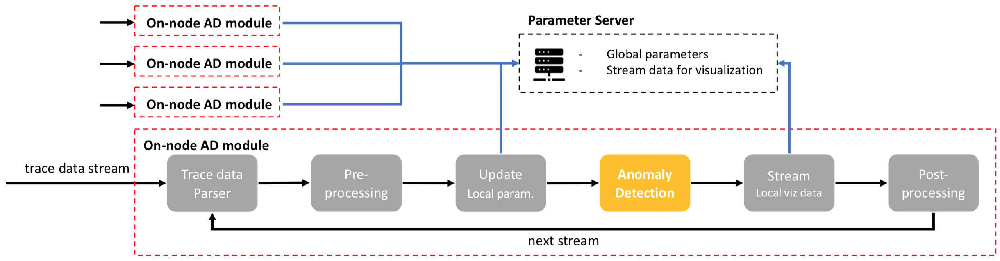

********
Overview
********

The anomaly detection (AD) module consists of two components: **on-node anomaly detection (AD)** and 
**paramter server (PS)**.

   Anomaly detection (AD) module: on-node AD module and paramter server (PS). 

.. include:: ad.rst
.. include:: ps.rst
