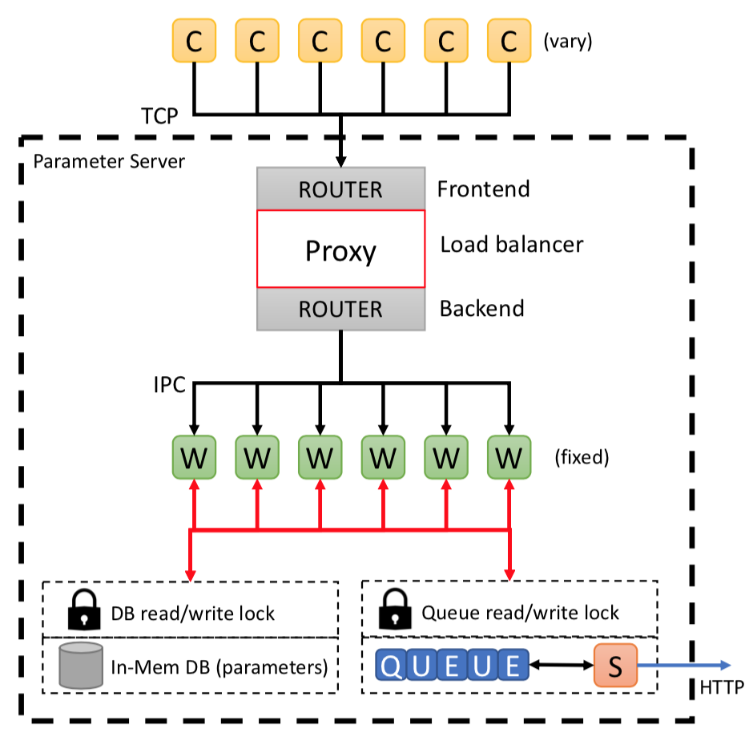

****************
Parameter Server
****************

The parameter server (PS) provides two services:

- Maintain global anomaly algorithm parameters to provide consistent and robust anomaly detection power over the on-node AD modules.
- Keep a global view of workflow-level performance trace analysis results which is streamed to the visualization server and also stored in the provenance database.

Design
------

   Parameter server architecture

(**C**)lients (i.e. on-node AD modules) send requests with their locally-computed anomaly detection algorithm parameters to be aggregated with the global parameters and the updated parameters returned to the client. Network communication is performed using the `ZeroMQ <https://zeromq.org>`_ library and using `Cereal <https://uscilab.github.io/cereal/>`_ for data serialization.

For handling requests from a large number of connected clients the parameter server uses a ROUTER-DEALER pattern whereby requests are sent to a **Frontend** router and distributed over thread (**W**)orkers
via the **Backend** router in round-robin fashion. For the task of updating parameters, workers first acquire a global lock, and update the **in-mem DB**, and return the updated parameters (cf. :ref:`api/api_code:SstdParam`). Global statistics on anomalies and counters are compiled in a similar way using the data sent from the AD instances (cf. `global_anomaly_stats <../api/api_code.html#global-anomaly-stats>`__ and `global_counter_stats <../api/api_code.html#global-counter-stats>`__) and also stored in this database.

A dedicated (**S**)treaming thread (cf. :ref:`api/api_code:PSstatSender`) is maintained that periodically sends the latest global statistics to the visualization server.

Anomaly ranking metrics
-----------------------

Two metrics are developed that are assigned to each outlier that allow the user to focus on the subset of anomalies that are most important:
the anomaly score reflects how unlikely an anomaly is, and the anomaly severity reflects how important the anomaly is to the runtime of the application.
PS includes these values in the provenance information and allow for the convenient sorting and filtering
of the anomalies in post-analysis. We have tested to present the individual choice of these metrics in the
online visualization module.

..
  While testing has demonstratedThis simple parameter server becomes a bottleneck as the number of requests (or clients) are increasing.
  In the following subsection, we will describe the scalable parameter server.
  Scalable Parameter Server
  -------------------------
  TBD
